# motsmartfirmware v0.3‑SMART (FULL/MINIMAL) – r1

**Platform:** ESP32 (Arduino / PlatformIO)

## Perubahan r1
- ✅ **Menu Kalibrasi di UI**: atur `V_SCALE`, `V_OFFSET`, `I_SCALE`, `I_OFFSET` lewat encoder → disimpan ke NVS.
- ✅ **Ikon status** di header OLED: **V**, **I**, **SD** (✔/✘).
- ✅ **Multi‑environment** pada `platformio.ini`:
  - `env:minimal` → tanpa logging, sensor opsional.
  - `env:full` → logging MicroSD aktif.

> ⚠️ **Keselamatan:** Repo ini hanya memuat **firmware, UI, dan wiring low‑voltage**. **Tidak** ada instruksi HV/AC/mains. Integrasi HV (SSR output, MOT, PLN) **WAJIB** ditangani profesional tersertifikasi.

## Build
1. Buka folder di **VS Code + PlatformIO**.
2. Pilih environment: **minimal** atau **full**.
3. Upload ke **ESP32 DevKit V1**. Default **SAFE_SIM=1**.

## Navigasi UI
- **Home → Detail → Running → Rating** seperti biasa.
- **Settings**: Click dari Home dua kali (Home→Detail→Settings via long‑press? lihat SmartUI).
- **Calibration**: dari **Settings** tekan **Click** untuk masuk, **Rotate** ganti nilai, **Click** lompat parameter, **Long‑press** untuk **Save & Exit**.

## File penting
- `pinmap.md` → tabel pin & warna kabel.
- `calibration.md` → panduan kalibrasi LV.

---

# motsmartfirmware v0.3‑SMART r2 → **Storyboard & Close‑ups** (Add‑on)

Dokumen ini menambahkan **Storyboard Wiring (8 frame)** dan **Close‑up** ke README proyek agar perakitan lebih cepat dan konsisten.

---

## 📽️ Wiring Storyboard (8 Frame)
Urutan kiri → kanan, 1 sampai 8. Klik gambar untuk tampilan penuh.

### Frame 1–4
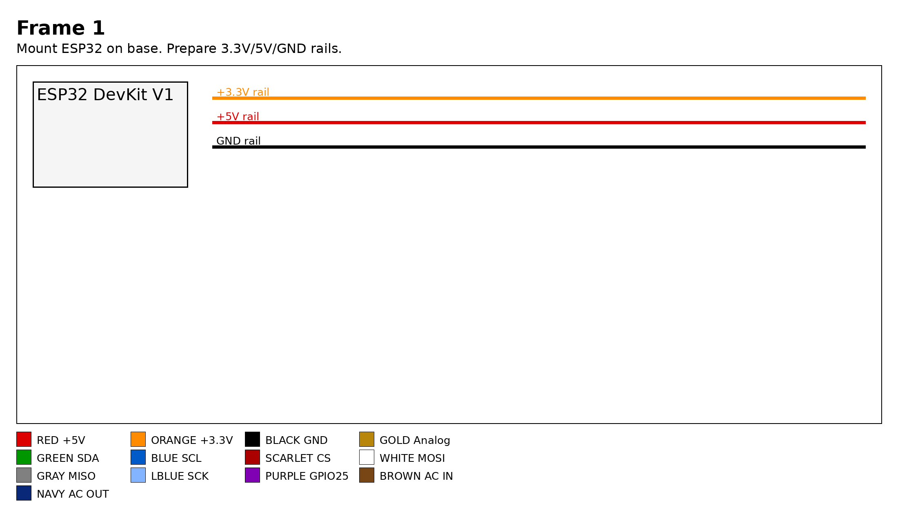
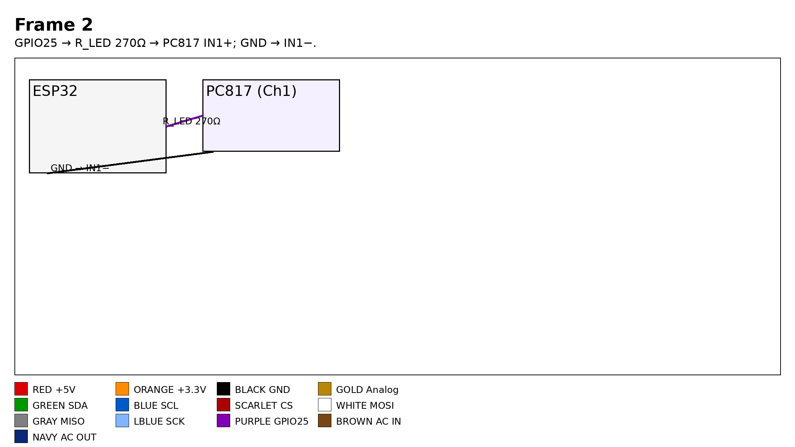
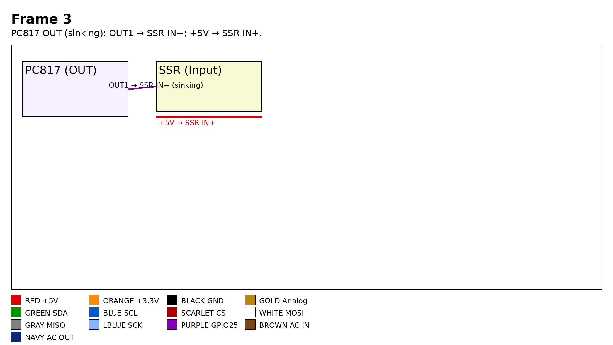
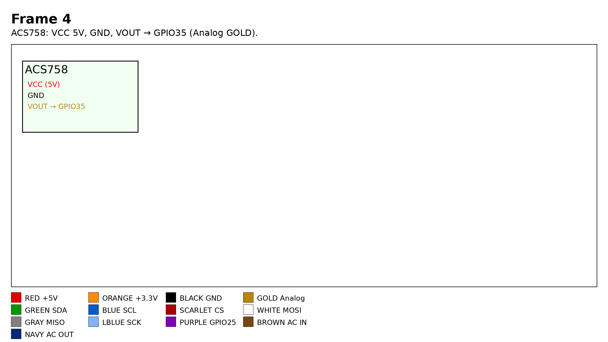

### Frame 5–8
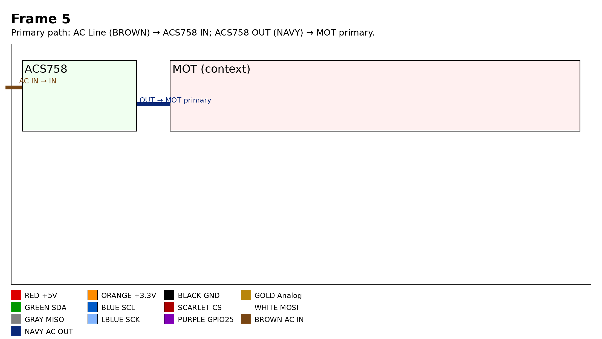
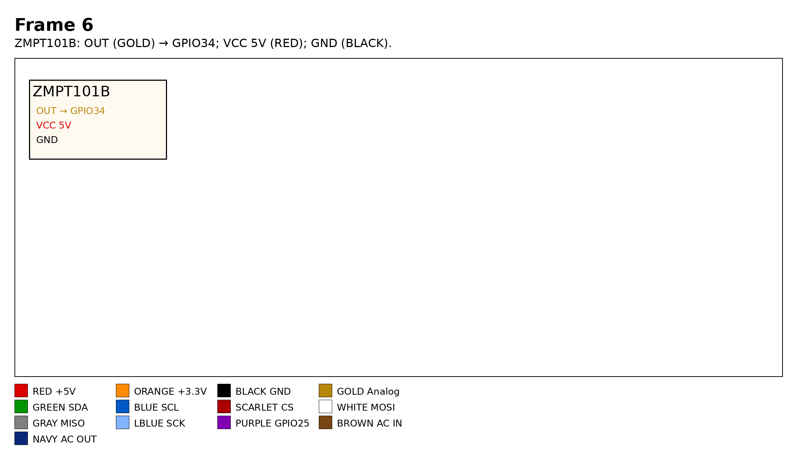
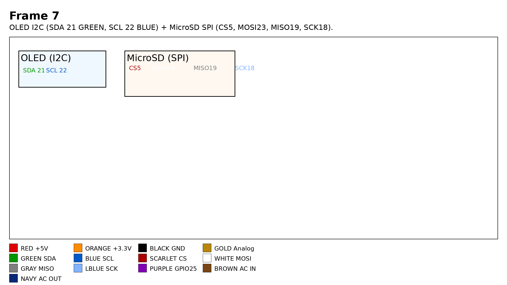
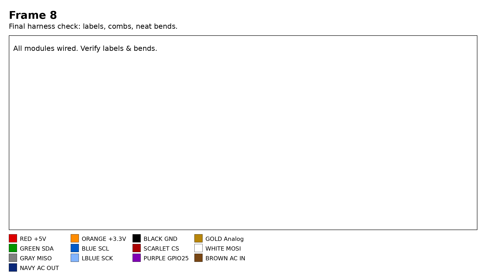

**Ringkasan langkah**
1. ESP32 di base; siapkan rail 3.3V/5V/GND.
2. GPIO25 → R_LED 270Ω → PC817 IN1+; GND → IN1−.
3. PC817 OUT (sinking): OUT1 → SSR IN−; +5V → SSR IN+.
4. ACS758: VCC 5V, GND, VOUT → GPIO35.
5. Jalur primer: AC Line (BROWN) → ACS758 IN; ACS758 OUT (NAVY) → MOT primer.
6. ZMPT101B: OUT (GOLD) → GPIO34; 5V (RED); GND (BLACK).
7. OLED I2C (SDA 21 GREEN, SCL 22 BLUE) + MicroSD SPI (CS5, MOSI23, MISO19, SCK18).
8. Final harness: label, cable‑comb, belokan rapi.

---

## 🔎 Close‑ups
### PC817 + SSR (Mode **Sinking** & **Source**)
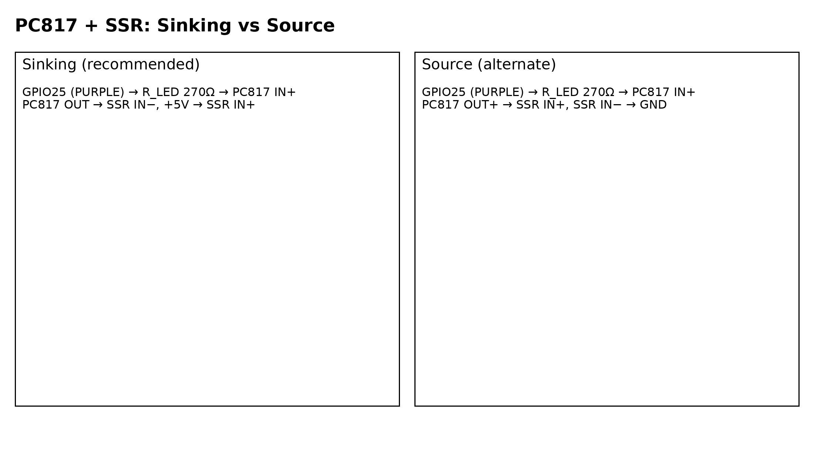

**Sinking (disarankan)**
- GPIO25 → R_LED 270Ω → PC817 IN+
- PC817 OUT → SSR IN−; **+5V → SSR IN+**

**Source (opsional)**
- GPIO25 → R_LED 270Ω → PC817 IN+
- **PC817 OUT+ → SSR IN+**; **SSR IN− → GND**

### ACS758 Terminal (M5, ring‑lug ≥4–6 mm² / contoh 25 mm²)
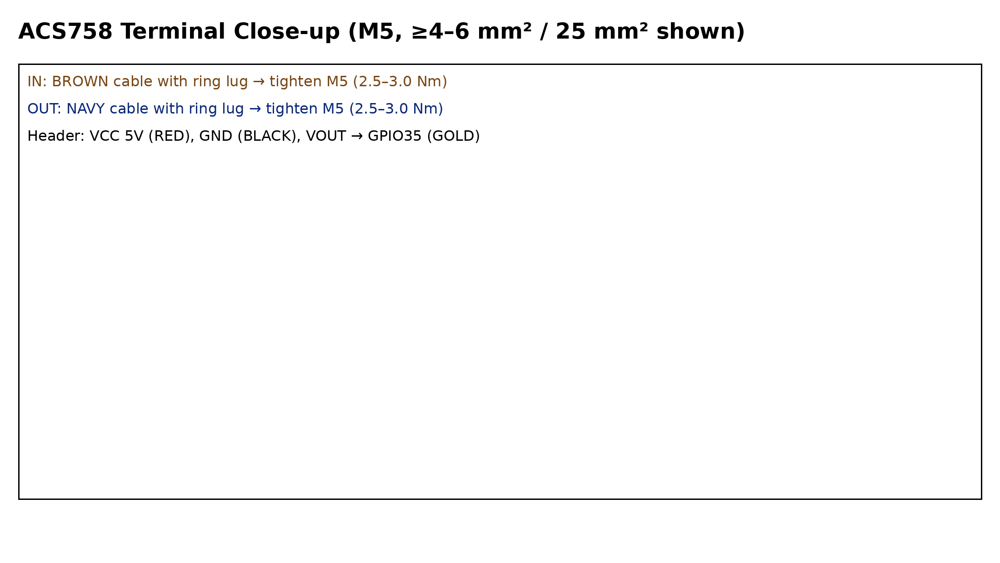

- IN: **BROWN** → ring‑lug → M5
- OUT: **NAVY** → ring‑lug → M5
- Header: **5V (RED)**, **GND (BLACK)**, **VOUT → GPIO35 (GOLD)**

### ZMPT101B (OUT/VCC/GND + Trimming)
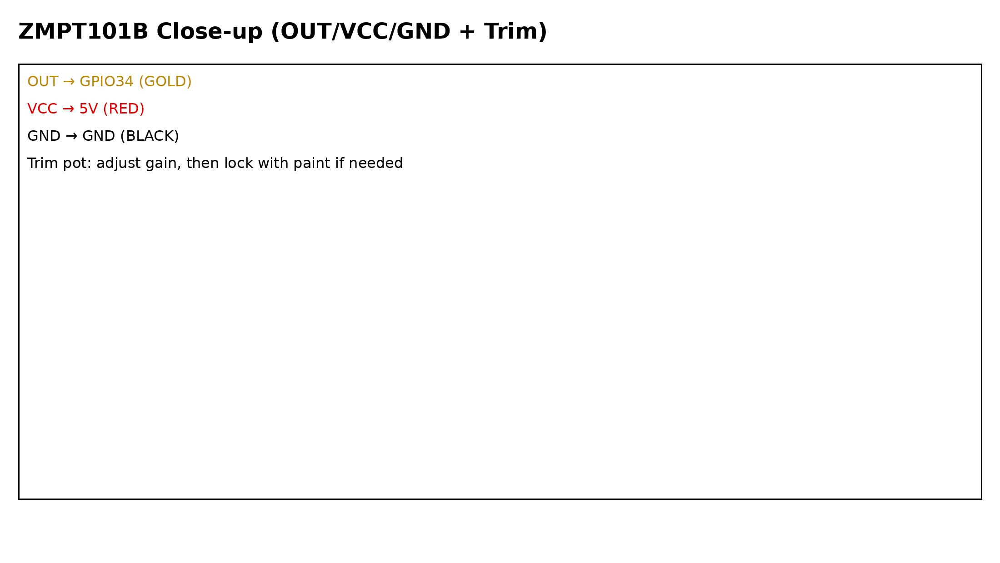

- **OUT → GPIO34 (GOLD)**
- **VCC → 5V (RED)**
- **GND → GND (BLACK)**
- Trim pot: setel gain, kunci dengan cat bila diperlukan

---

## 📄 PDF Siap Cetak
- **A3**: [Storyboard_and_Closeups_A3.pdf](docs/Storyboard_and_Closeups_A3.pdf)
- **A4**: [Storyboard_and_Closeups_A4.pdf](docs/Storyboard_and_Closeups_A4.pdf)

---

## 🎨 Legend Warna Kabel (konsisten proyek)
- **RED** = +5V • **ORANGE** = +3.3V • **BLACK** = GND • **GOLD** = Analog (ACS758 VOUT → GPIO35; ZMPT OUT → GPIO34)
- **GREEN** = SDA • **BLUE** = SCL • **SCARLET** = CS • **WHITE** = MOSI • **GRAY** = MISO • **LBLUE** = SCK
- **PURPLE** = GPIO25 (kontrol PC817) • **BROWN** = AC IN → ACS758 IN • **NAVY** = AC OUT → MOT primer

